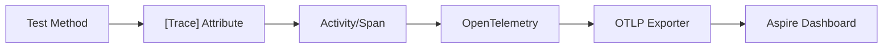

# xUnitOTel

<p align="center">
  
</p>

[](https://github.com/mrviduus/xUnitOTel/actions)
[](https://www.nuget.org/packages/xUnitOTel/)
[](https://www.nuget.org/packages/xUnitOTel/)
[](https://opensource.org/licenses/MIT)

OpenTelemetry instrumentation for xUnit v3 tests. Automatically wraps tests in distributed tracing spans with HTTP, SQL, and gRPC instrumentation.

## Table of Contents

- [Requirements](#requirements)
- [Installation](#installation)
- [Quick Start](#quick-start)
- [How It Works](#how-it-works)
- [Configuration](#configuration)
- [Viewing Telemetry](#viewing-telemetry)
- [API Reference](#api-reference)
- [Troubleshooting](#troubleshooting)
- [License](#license)

## Requirements

- **.NET Standard 2.0** compatible runtime (.NET Framework 4.6.1+, .NET Core 2.0+, .NET 5+)
- **xUnit v3** (not compatible with xUnit v2)

## Installation

```bash
dotnet add package xUnitOTel
```

## Quick Start

### 1. Create TestSetup fixture

```csharp
using Microsoft.Extensions.DependencyInjection;
using Microsoft.Extensions.Hosting;
using Microsoft.Extensions.Logging;
using OpenTelemetry.Logs;
using OpenTelemetry.Metrics;
using OpenTelemetry.Trace;
using xUnitOTel.Diagnostics;

public class TestSetup : IAsyncLifetime
{
    private IHost _host = null!;
    public IHost Host => _host;

    public T GetRequiredService<T>() where T : notnull
        => _host.Services.GetRequiredService<T>();

    public async ValueTask InitializeAsync()
    {
        var builder = Microsoft.Extensions.Hosting.Host.CreateApplicationBuilder();

        builder.Services.AddOTelDiagnostics(
            configureMeterProviderBuilder: m => m.AddOtlpExporter(),
            configureTracerProviderBuilder: t => t.AddOtlpExporter(),
            configureLoggingBuilder: options => options.AddOpenTelemetry(o => o.AddOtlpExporter())
        );

        builder.Services.AddHttpClient();

        _host = builder.Build();
        await _host.StartAsync();
    }

    public async ValueTask DisposeAsync()
    {
        await _host.StopAsync();
        _host.Dispose();
    }
}
```

### 2. Enable tracing

Add to any test file to trace all tests in the assembly:

```csharp
[assembly: Trace]
[assembly: AssemblyFixture(typeof(TestSetup))]
```

Or apply `[Trace]` to individual test methods.

### 3. Write tests

```csharp
public class ApiTests(TestSetup fixture)
{
    [Fact]
    public async Task GetUsers_ReturnsSuccess()
    {
        var client = fixture.GetRequiredService<IHttpClientFactory>().CreateClient();
        var response = await client.GetAsync("https://api.example.com/users");
        Assert.True(response.IsSuccessStatusCode);
    }
}
```

All HTTP requests, timing, and trace IDs appear in test output automatically.

<p align="center">
  
</p>

## How It Works



1. `TestSetup` creates Host with `AddOTelDiagnostics()` configuring OpenTelemetry
2. `[Trace]` attribute wraps tests in Activity spans
3. Spans tagged with `test.class.method`, `test.name`, `test.framework`
4. HTTP/SQL/gRPC calls auto-instrumented as child spans
5. Logs attached as Activity events

## Configuration

### AddOTelDiagnostics Options

| Parameter | Type | Description |
|-----------|------|-------------|
| `serviceName` | `string?` | Service name for telemetry (default: entry assembly name) |
| `configureMeterProviderBuilder` | `Action<MeterProviderBuilder>?` | Configure metrics exporters |
| `configureTracerProviderBuilder` | `Action<TracerProviderBuilder>?` | Configure trace exporters |
| `configureLoggingBuilder` | `Action<ILoggingBuilder>?` | Configure log exporters |

### Trace Attribute Properties

| Property | Type | Default | Description |
|----------|------|---------|-------------|
| `CaptureError` | `bool` | `true` | Capture stderr to test output |
| `CaptureOut` | `bool` | `true` | Capture stdout to test output |

### OpenTelemetry Tags

| Tag | Description |
|-----|-------------|
| `test.class.method` | Full test class and method name |
| `test.name` | Test method name |
| `test.framework` | Always "xunit" |
| `testrun.id` | Unique ID for test run session |

## Viewing Telemetry

### Aspire Dashboard (Recommended)

Start the dashboard:

```bash
docker run -d \
  -p 18888:18888 \
  -p 4317:18889 \
  -e DOTNET_DASHBOARD_UNSECURED_ALLOW_ANONYMOUS=true \
  --name aspire-dashboard \
  mcr.microsoft.com/dotnet/aspire-dashboard:9.0
```

Open http://localhost:18888 to view traces.

### Console Exporter

For simple debugging without external tools:

```csharp
builder.Services.AddOTelDiagnostics(
    configureTracerProviderBuilder: t => t.AddConsoleExporter()
);
```

## API Reference

### TraceAttribute

xUnit `BeforeAfterTestAttribute` that wraps tests in OpenTelemetry spans.

```csharp
// Assembly-level (all tests)
[assembly: Trace]

// Method-level
[Fact]
[Trace]
public void MyTest() { }
```

### OTelConfigurationExtensions

Entry point for configuring OpenTelemetry.

```csharp
services.AddOTelDiagnostics(
    serviceName: "MyTests",
    configureTracerProviderBuilder: t => t.AddOtlpExporter()
);
```

### ApplicationDiagnostics

Static `ActivitySource` for creating custom spans:

```csharp
using var activity = ApplicationDiagnostics.ActivitySource.StartActivity("CustomOperation");
// ... operation code
```

## Troubleshooting

### [Trace] attribute has no effect

The attribute requires OpenTelemetry to be configured via `AddOTelDiagnostics()`. Ensure your `TestSetup` fixture is properly registered with `[assembly: AssemblyFixture(typeof(TestSetup))]`.

### No spans appearing in dashboard

1. Verify OTLP endpoint is reachable (default: `localhost:4317`)
2. Check that `AddOtlpExporter()` is configured
3. Ensure Aspire Dashboard is running

### xUnit v2 compatibility

This package only supports xUnit v3. For xUnit v2, consider upgrading or using a different instrumentation approach.

### Missing HTTP/SQL instrumentation

`AddOTelDiagnostics()` automatically adds instrumentation for:
- `System.Net.Http` (HttpClient)
- `System.Data.SqlClient` / `Microsoft.Data.SqlClient`
- gRPC clients

Ensure these libraries are used via dependency injection from the Host.

## License

MIT License - see [LICENSE](LICENSE) for details.
